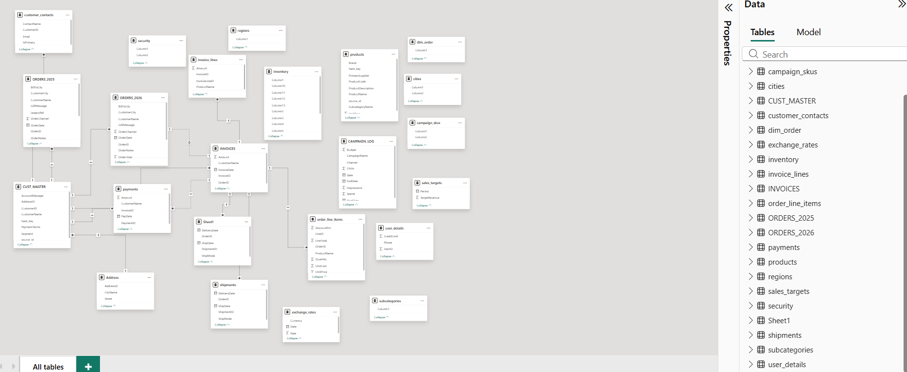
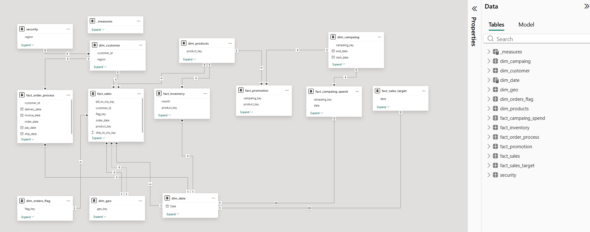

# From Chaos to Star Schema: A Data Modeling Project

## The Problem

I got handed a "data model" that was really just a pile of tables someone had exported from different systems and dumped into one workspace. No real structure, no naming convention, barely any usable relationships.

A few examples of what I was working with:

- **Orders split by year** — `ORDERS_2025` and `ORDERS_2026` as two separate tables instead of one, which meant every year-over-year query needed a UNION before you could even start
- **Duplicate customer data** — `CUST_MASTER` and `customer_contacts` both holding overlapping customer info, with no clear source of truth
- **Mystery columns** — Tables like `regions`, `security`, `cities`, and `campaign_skus` full of columns literally named `Column1`, `Column2`, `Column3`... no idea what they actually held without opening each one
- **Inconsistent naming** — a mix of `PascalCase`, `snake_case`, and `ALL_CAPS` table names in the same model (`INVOICES`, `payments`, `ORDERS_2025` all sitting next to each other)
- **No clean grain** — invoices, orders, payments, shipments, and inventory were all loosely linked with unclear cardinality, so relationships were guesswork

Basically, this was a reporting nightmare waiting to happen. Any dashboard built on top of this would have been slow, error-prone, and impossible for anyone else to maintain.

## What I Did

I rebuilt it from scratch as a proper **star schema**, separating the model into clear **fact** and **dimension** tables:

**Fact tables** (the "what happened" tables — transactions and events):
- `fact_sales`
- `fact_order_process`
- `fact_inventory`
- `fact_promotion`
- `fact_campaing_spend`
- `fact_sales_target`

**Dimension tables** (the "who/what/when/where" — context for the facts):
- `dim_customer`
- `dim_products`
- `dim_campaing`
- `dim_date`
- `dim_geo`
- `dim_orders_flag`

Along the way I:
- Merged the year-split order tables into a single time-consistent fact, with `dim_date` handling all date logic instead of hardcoding years into table names
- Collapsed the duplicate customer tables into one clean `dim_customer`
- Replaced the vague `Column1, Column2...` fields with actual named, typed, meaningful columns
- Introduced proper surrogate keys (`customer_id`, `product_key`, `campaing_key`, `geo_key`, `flag_key`) so relationships are explicit instead of implied
- Standardized naming across the whole model so every table and column follows the same convention
- Set up clean one-to-many relationships between facts and dimensions, so filtering by customer, product, geography, or campaign now actually works the way it should

## Before vs After

| | Before | After |
|---|---|---|
| Structure | Flat, tangled, ad-hoc | Star schema |
| Orders | Split by year | Unified fact table |
| Customer data | Duplicated across 2 tables | Single `dim_customer` |
| Column names | `Column1`, `Column2`... | Descriptive, typed columns |
| Naming convention | Mixed (Upper/Pascal/snake) | Consistent snake_case |
| Relationships | Unclear / guesswork | Explicit keys, clean cardinality |

## Why This Matters

A clean star schema isn't just about looking tidy — it directly affects:
- **Query performance** — fewer joins, less duplication, faster aggregations
- **Maintainability** — anyone opening this model six months from now can understand it in minutes, not hours
- **Reporting accuracy** — no more double-counting from duplicate tables or ambiguous relationships
- **Scalability** — new fact tables (a new campaign type, a new sales channel) can be added without breaking the existing model

## Tools Used

- Power BI (Data Modeling view)

## Screenshots

**Before — the original, unstructured model**

---
**After — the finished star schema**

Feel free to open an issue or reach out if you want to talk through any of the design decisions.
